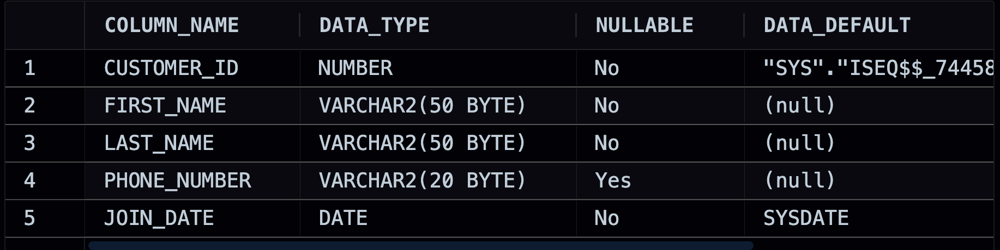
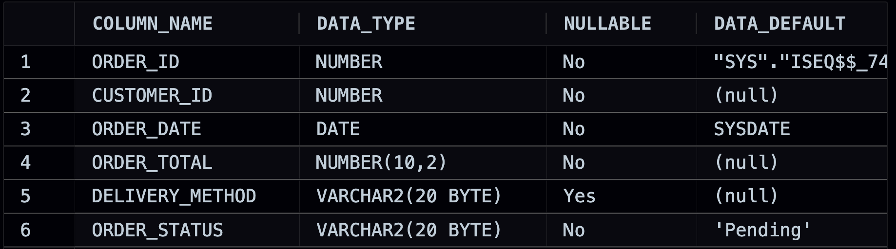
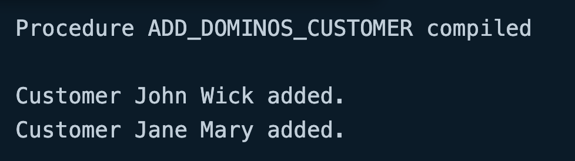
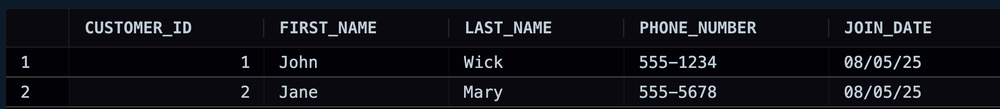
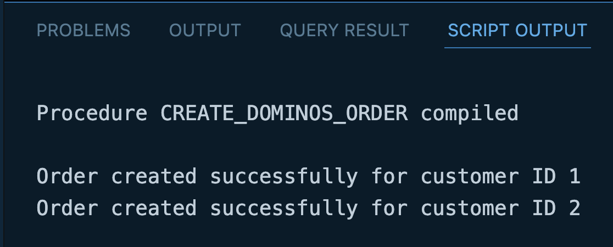
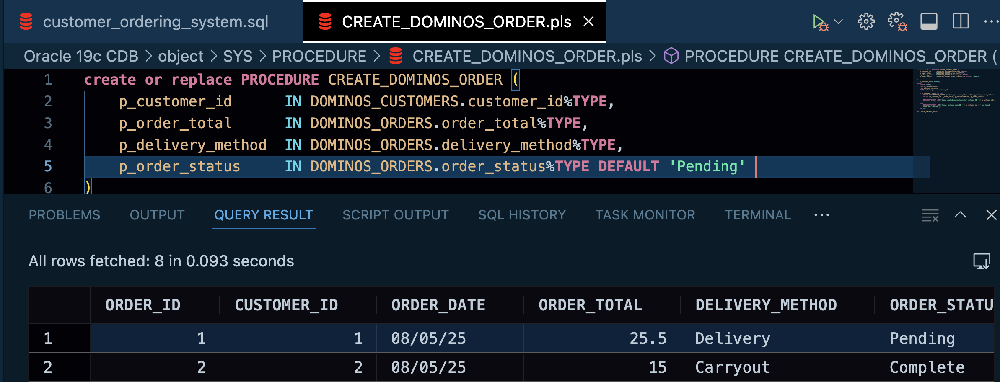
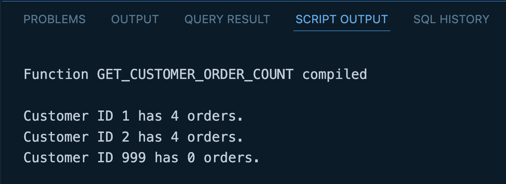
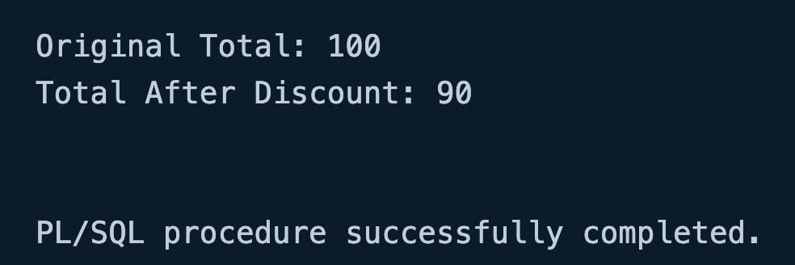

# Welcome to my Domino's Pizza's Customer Ordering System using PL/SQL!!!
This project implements a customer ordering system for Domino's Pizza using PL/SQL. It covers fundamental database concepts and programming constructs within the Oracle database environment.

Throughout this project, utilizing our PL/SQL skills we'll build the following components:

**Database Design**: Creation and management of **DOMINOS_CUSTOMERS** and **DOMINOS_ORDERS** tables for structured data storage.   

**Stored Procedures**: We'll build three stored procedures such as **ADD_DOMINOS_CUSTOMER**(adds new Domino's customers), **CREATE_DOMINOS_ORDER** (handles new orders, including checking for customer existence) and **APPLY_DISCOUNT**(modifies an order total based on a discount rate).  

**Custom Function**: We'll develop the function **GET_CUSTOMER_ORDER_COUNT** which returns the total number of orders for a given customer ID.

**PL/SQL Fundamentals**: Utilization of DECLARE, BEGIN, and END blocks, variable declaration and usage, and basic arithmetic operations.   

This project provides a foundational understanding of building a simple customer ordering system and highlights key PL/SQL programming techniques and database interactions.

## STEP 1: Creating Database Tables

We begin by creating a **DOMINOS_CUSTOMERS** table to store the information about our loyal pizza customers.
```sql
CREATE TABLE DOMINOS_CUSTOMERS (
    customer_id   NUMBER GENERATED ALWAYS AS IDENTITY PRIMARY KEY,
    first_name    VARCHAR2(50) NOT NULL,
    last_name     VARCHAR2(50) NOT NULL,
    phone_number  VARCHAR2(20) UNIQUE, 
    join_date     DATE DEFAULT SYSDATE NOT NULL
);
```



Next, we will create **DOMINOS_ORDER** table to record each order placed by a customer and define a foreign key constraint to link orders back to the customers.
```sql
CREATE TABLE DOMINOS_ORDERS (
    order_id         NUMBER GENERATED ALWAYS AS IDENTITY PRIMARY KEY,
    customer_id      NUMBER NOT NULL,
    order_date       DATE DEFAULT SYSDATE NOT NULL,
    order_total      NUMBER(10, 2) NOT NULL,
    delivery_method  VARCHAR2(20), 
    order_status     VARCHAR2(20) DEFAULT 'Pending' NOT NULL,

    CONSTRAINT fk_dominos_customer
        FOREIGN KEY (customer_id)
        REFERENCES DOMINOS_CUSTOMERS(customer_id)
);
```



## Step-2 Creating the ADD_DOMINOS_CUSTOMER Stored Procedure
Let's create a stored procedure to handle adding new customers to our **DOMINOS_CUSTOMERS** table. This procedure will demonstrate creating a stored procedure, using IN parameters, and embedding an INSERT statement within PL/SQL.

```sql
CREATE OR REPLACE PROCEDURE ADD_DOMINOS_CUSTOMER (
    p_first_name   IN DOMINOS_CUSTOMERS.first_name%TYPE,
    p_last_name    IN DOMINOS_CUSTOMERS.last_name%TYPE,
    p_phone_number IN DOMINOS_CUSTOMERS.phone_number%TYPE
)
IS
BEGIN
    INSERT INTO DOMINOS_CUSTOMERS (first_name, last_name, phone_number)
    VALUES (p_first_name, p_last_name, p_phone_number);

    DBMS_OUTPUT.PUT_LINE('Customer ' || p_first_name || ' ' || p_last_name || ' added.');

END ADD_DOMINOS_CUSTOMER;
/
```
Compile the procedure by executing the code block above in your Oracle client tool.

Test the procedure by calling it from an anonymous PL/SQL block.
```sql
SET SERVEROUTPUT ON;
BEGIN 
  ADD_DOMINOS_CUSTOMER('John', 'Wick', '555-1234');
  ADD_DOMINOS_CUSTOMER('Jane', 'Mary', '555-5678'); 
END;
/
```



Verify that the procedure worked and see the customers by selecting from the table.
```sql
SELECT * FROM DOMINOS_CUSTOMERS;
```



## Step - 3 Handling orders with CREATE_DOMINOS_ORDER procedure
This procedure will take customer and order details as input and add a new order to the DOMINOS_ORDERS table. This procedure demonstrates using IN parameters, checking for data existence using SELECT INTO, and implementing conditional logic with IF-ELSE before performing an INSERT.

```sql
CREATE OR REPLACE PROCEDURE CREATE_DOMINOS_ORDER (
    p_customer_id      IN DOMINOS_CUSTOMERS.customer_id%TYPE,
    p_order_total      IN DOMINOS_ORDERS.order_total%TYPE,
    p_delivery_method  IN DOMINOS_ORDERS.delivery_method%TYPE,
    p_order_status     IN DOMINOS_ORDERS.order_status%TYPE DEFAULT 'Pending' 
)
IS
    v_customer_count NUMBER;
BEGIN
    SELECT COUNT(*)
    INTO v_customer_count
    FROM DOMINOS_CUSTOMERS
    WHERE customer_id = p_customer_id;

    IF v_customer_count = 1 THEN
        INSERT INTO DOMINOS_ORDERS (customer_id, order_total, delivery_method, order_status)
        VALUES (p_customer_id, p_order_total, p_delivery_method, p_order_status);

        DBMS_OUTPUT.PUT_LINE('Order created successfully for customer ID ' || p_customer_id);

    ELSE
        DBMS_OUTPUT.PUT_LINE('Error: Customer with ID ' || p_customer_id || ' not found. Order not created.');
    END IF;

END CREATE_DOMINOS_ORDER;
/
```
Compile the procedure by executing the code block above.



Test the procedure by calling it from an anonymous PL/SQL block.
```sql
SET SERVEROUTPUT ON;
BEGIN
    CREATE_DOMINOS_ORDER(
        p_customer_id => 1,
        p_order_total => 25.50,
        p_delivery_method => 'Delivery'
    );

     CREATE_DOMINOS_ORDER(
        p_customer_id => 2,
        p_order_total => 15.00,
        p_delivery_method => 'Carryout',
        p_order_status => 'Complete' 
    );
    DBMS_OUTPUT.PUT_LINE('Transaction committed.');
END;
/
```



## Step - 4 Creating the GET_CUSTOMER_ORDER_COUNT Function
This function will take a customer ID as input and return the total number of orders that customer has placed in the **DOMINOS_ORDERS** table. This demonstrates creating a function, using an IN parameter, using SELECT INTO to fetch an aggregate value (COUNT(*)), and using the RETURN clause.

```sql
CREATE OR REPLACE FUNCTION GET_CUSTOMER_ORDER_COUNT (
    p_customer_id IN DOMINOS_CUSTOMERS.customer_id%TYPE
)
RETURN NUMBER 
IS
    v_order_count NUMBER := 0; 
BEGIN
    SELECT COUNT(*)
    INTO v_order_count
    FROM DOMINOS_ORDERS
    WHERE customer_id = p_customer_id;

    RETURN v_order_count;

EXCEPTION
    WHEN NO_DATA_FOUND THEN
        RETURN 0;

END GET_CUSTOMER_ORDER_COUNT;
/
```
Compile the function by executing the code block above in your Oracle client tool.

Test the function by calling it from an anonymous PL/SQL block (Functions can also be called directly within SQL queries).
```sql
SET SERVEROUTPUT ON;
DECLARE
    v_customer_id_to_check NUMBER := 1; 
    v_orders_count NUMBER;
BEGIN
    v_orders_count := GET_CUSTOMER_ORDER_COUNT(v_customer_id_to_check);
    DBMS_OUTPUT.PUT_LINE('Customer ID ' || v_customer_id_to_check || ' has ' || v_orders_count || ' orders.');

    DBMS_OUTPUT.PUT_LINE('Customer ID 2 has ' || GET_CUSTOMER_ORDER_COUNT(2) || ' orders.'); 
    DBMS_OUTPUT.PUT_LINE('Customer ID 999 has ' || GET_CUSTOMER_ORDER_COUNT(3) || ' orders.'); 
END;
/
```



## STEP-5 Handling Customer Discounts with APPLY_DISCOUNT Procedure
Let's create a procedure called APPLY_DISCOUNT that takes an order total as an IN OUT parameter and applies a fixed discount. This demonstrates the use of an IN OUT parameter, which allows a value to be passed into the procedure, modified, and the updated value passed back to the calling environment.
```sql
CREATE OR REPLACE PROCEDURE APPLY_DISCOUNT (
    p_order_total   IN OUT NUMBER, 
    p_discount_rate IN NUMBER      
)
IS
BEGIN
    p_order_total := p_order_total * (1 - p_discount_rate);
END APPLY_DISCOUNT;
/
```
Compile the procedure by executing the code block above in your Oracle client tool.

Test the procedure using an anonymous PL/SQL block to demonstrate how the IN OUT parameter changes the value of a variable passed into it.
```sql
SET SERVEROUTPUT ON;

DECLARE
    v_current_total NUMBER := 100.00; 
    v_discount_rate NUMBER := 0.10;   
BEGIN
    DBMS_OUTPUT.PUT_LINE('Original Total: ' || v_current_total);

    APPLY_DISCOUNT(
        p_order_total   => v_current_total, 
        p_discount_rate => v_discount_rate
    );

    DBMS_OUTPUT.PUT_LINE('Total After Discount: ' || v_current_total);

END;
/
```



## Conclusion
This project successfully built the outlined Domino's customer and order tables, implemented the specified stored procedures and function, and demonstrated fundamental PL/SQL concepts, effectively covering the planned scope.


